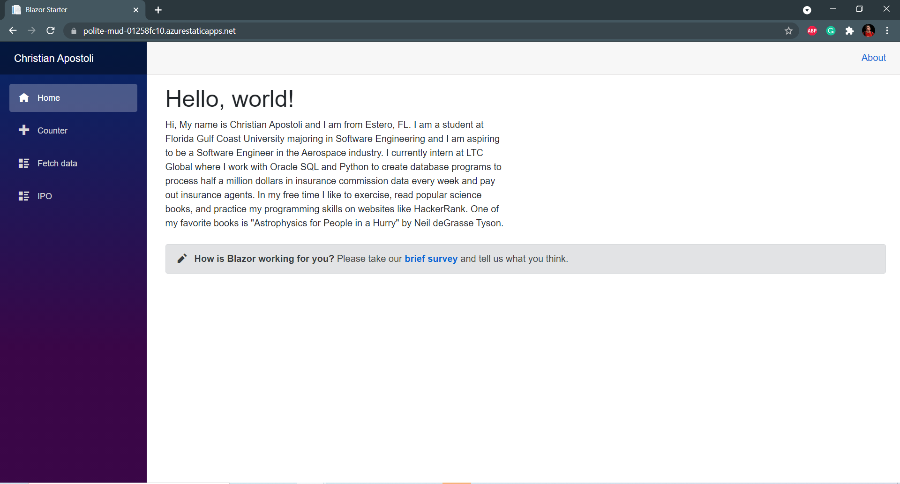
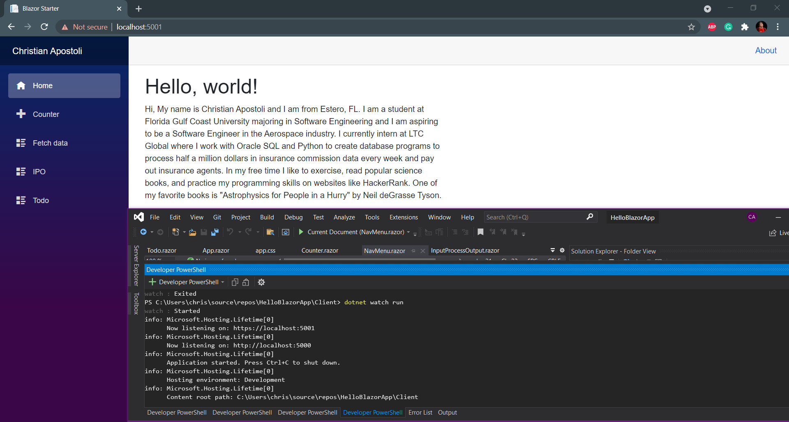

# Blazor Starter Application

This template contains an example [Blazor WebAssembly](https://docs.microsoft.com/aspnet/core/blazor/?view=aspnetcore-3.1#blazor-webassembly) client application, a C# [Azure Functions](https://docs.microsoft.com/azure/azure-functions/functions-overview) and a C# class library with shared code.

## Getting Started
Download the .NET SDK
``` sh
# Verifies .NET SDK has been downloaded correctly
> dotnet

#Creates new Blazor Application
> dotnet new blazorserver -o BlazorApp --no-https

#Runs your Blazor Application
> cd BlazorApp
> dotnet watch run
```
Make sure to have ASP.NET and web development workload downloaded in Visual Studio to run your Blazor app in the terminal within Visual Studio.

To Run your project within Visual Studio, open the **Client** folder of your project in the terminal, and run the dotnet watch run command.

## Template Structure

- **Client**: The Blazor WebAssembly sample application
- **API**: A C# Azure Functions API, which the Blazor application will call
- **Shared**: A C# class library with a shared data model between the Blazor and Functions application

## Deploy to Azure Static Web Apps

This application can be deployed to [Azure Static Web Apps](https://docs.microsoft.com/azure/static-web-apps), to learn how, check out [a quickstart guide](https://aka.ms/blazor-swa/quickstart). <br/>
Here is the link to my static web app: https://polite-mud-01258fc10.azurestaticapps.net/

## Demo
Home


In Terminal from Visual Studio - This is useful for editing and testing on local machine


## Updates
- SEP 14 2021: Created Blazor project
- SEP 21 2021: Added IPO page
- OCT 04 2021: Added Todo page

## Author
- Christian Apostoli

## Acknowledgement 
- https://devblogs.microsoft.com/aspnet/azure-static-web-apps-with-blazor/
- https://dotnet.microsoft.com/learn/aspnet/blazor-tutorial/intro
- https://sites.google.com/site/profvanselow/programming/languages/c_1/blazor 
- https://docs.microsoft.com/en-us/aspnet/core/tutorials/build-a-blazor-app?view=aspnetcore-5.0


